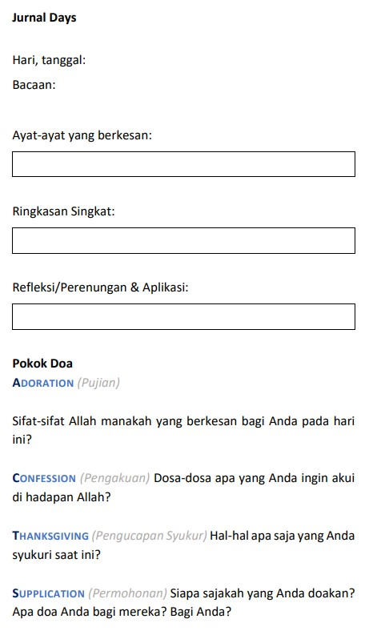
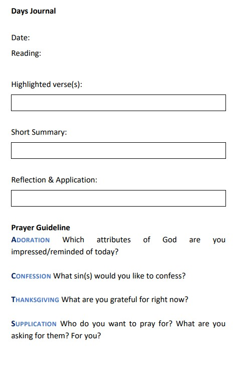
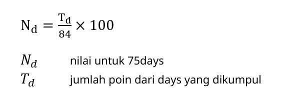

# 75days

- jurnal saat teduh harian
- perhitungan poin: **Jurnal Days** - [Template .docx](./assets/docs/template-days.docx)
- masa **days**: 7 Oktober 2024 - 29 Desember 2024
- **kumpul days dalam .docx di [https://wi2012.com/kumpul](https://wi2012.com/kumpul)**
- **kumpul setiap hari sebelum 23:55 WIB**, maks. terlambat 7 hari

* * *

Dalam 75days, mahasiswa diajak untuk menulis jurnal harian berupa **days**, yang berisi refleksi dan doa dari Firman Tuhan dan saat teduh. Melalui perjalanan 75 hari menulis **days**, harapannya adalah mahasiswa dapat merasakan pertemuan dan pengenalan pribadi dengan Tuhan, yang akan terus belanjut setelah kuliah selesai.

#### Panduan 75days

Tiap **days** dapat dilakukan dalam 7 menit!
- ½ menit:	siapkan hati untuk menjurnal, minta pimpinan Roh Kudus dalam doa
- 4 menit: 	dengarlah suara Tuhan melalui Alkitab
- 2 ½ menit: 	berbicaralah kepada Tuhan, berdoa (contohnya **ACTS**)
    - **A**doration/Penyembahan: lihatlah dan pujilah kasih, kuasa, keagungan, serta anugerah-Nya yang terindah, yaitu Kristus.
    - **C**onfession/Pengakuan: datanglah kepada Tuhan dengan jujur dan rendah hati, mengakui setiap dosa kita kepada-Nya.
    - **T**hanksgiving/Pengucapan syukur: ingatlah dan bersyukur, ucapkan terima kasih untuk segala yang sudah Tuhan berikan, bahkan hal-hal yang tidak menyenangkan sekalipun.
    - **S**upplication/Permohonan: “ask for, earnestly, and humbly”, bawakanlah kepada Tuhan permohonan kita, untuk orang lain dan untuk diri sendiri

Panduan ini dapat disesuaikan Mentor masing-masing.

* * *

## Masa, Pengumpulan, dan Penilaian 7MBT

Masa **days**: 7 Oktober 2024 - 29 Desember 2024 (**3 bulan**)

Tiap **days** ditulis dan dikumpulkan pada hari yang sama, pengumpulan menggunakan Microsoft Forms.

**Kumpul _days_ dalam bentuk .docx di [https://wi2012.com/kumpul](https://wi2012.com/kumpul)**

Untuk tiap **days** terkumpul, poin yang dapat diperoleh adalah

| Ketepatan waktu / Kesesuaian | Baik | Tidak Sesuai |
|:-----------------------------|:----:|:-----------:|
| **Tepat Waktu** | 1 | 0 |
| **Terlambat (<= 7 hari)** | 0,5 | 0 |
| **Terlambat (> 7 hari)** | 0 | 0 |

* * *

### Akumulasi Poin

**Days** dilakukan minimal 25 kali per bulan (25 hari/bulan), sehingga diperoleh 75 days
- max point: 25 * 3 bulan = 75
- tidak perlu streak atau mengerjakan berderet
- hari tidak wajib: **bonus**, tidak wajib

| Bulan | Hari wajib | Hari Bonus | Total |
|:-----:|:---------:|:---------:|:-----:|
| Oktober | 25 | 0 | 25 |
| November | 25 | 5 | 30 |
| Desember | 25 | 4 | 29 |
|==========+==========+==========+======|
| **Total** | 75 | 9 | 84 |

Perhitungan nilai untuk 75days

