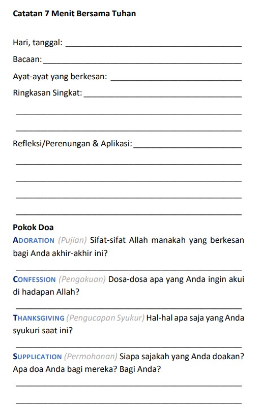
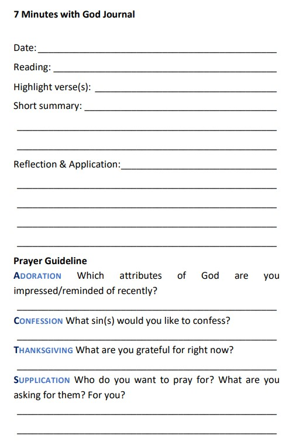
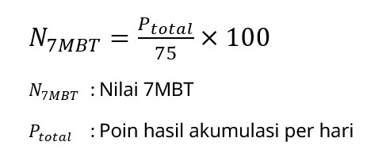

# 7 Menit Bersama Tuhan (7MBT)

- saat teduh harian 
- penilaian: **Catatan 7MBT** - [Template .docx](./assets/docs/template-7mbt.docx)
- periode: 3 Maret 2024 - 25 Mei 2024
- **kumpul .docx di [Microsoft Forms (klik di sini)](https://forms.office.com/r/gMtpCDpvbj)**
- **deadline harian: 23:55 WIB**, maks. terlambat 7 hari

* * *

7 Menit Bersama Tuhan (7MBT) bertujuan agar mahasiswa membangun hubungan dengan Tuhan setiap hari secara disiplin dan konsisten, sehingga membentuk kebiasaan baru yang berlanjut hingga setelah kuliah agama, yakni saat teduh / waktu pribadi dengan Tuhan.

#### Format dan Template 7MBT

Rutinitas saat teduh dengan 7MBT adalah:
- ½ menit:	menyiapkan hati (berdoa untuk pimpinan Roh Kudus)
- 4 menit: 	mendengarkan Tuhan (membaca Alkitab)
- 2 ½ menit: 	berbicara kepada Tuhan (berdoa dengan model ACTS)
    - Adoration/Penyembahan: merenungkan tentang Allah. Pujilah kasih-Nya, kuasa dan keagungan-Nya, serta anugerah-Nya yang terindah, yaitu Kristus.
    - Confession/Pengakuan: mengakui dosa-dosa kepada Allah. Bersikaplah jujur dan rendah hati.
    - Thanksgiving/Pengucapan syukur: berterima kasih untuk segala yang sudah Tuhan berikan, bahkan hal-hal yang tidak menyenangkan sekalipun.
    - Supplication/Permohonan: “ask for, earnestly, and humbly”, permohonan spesifik bagi orang lain, lalu diri sendiri

Framework ini dapat disesuaikan Mentor masing-masing.

Contoh template 7MBT disediakan pada Microsoft Teams dan link berikut:
[Template Catatan 7MBT dalam .docx](./assets/docs/template-7mbt.docx)

* * *

## Masa, Pengumpulan, dan Penilaian 7MBT

Periode: 3 Maret 2024 - 25 Mei 2024 (**3 bulan**)

Pengumpulan dilakukan dengan Microsoft Forms secara harian di hari itu juga.

**Kumpul .docx di [Microsoft Forms (klik di sini)](https://forms.office.com/r/gMtpCDpvbj)**

Untuk tiap hari terkumpul, nilai yang dapat diperoleh adalah

| Ketepatan waktu \ Kesesuaian | Baik | Tidak Sesuai |
|:-----------------------------|:----:|:-----------:|
| **Tepat Waktu** | 1 | 0 |
| **Terlambat (<= 7 hari)** | 0,5 | 0 |
| **Terlambat (> 7 hari)** | 0 | 0 |

* * *

### Akumulasi Poin

7MBT dikerjakan minimal 25 kali per bulan (25 hari/bulan)

- max point: 25 * 3 bulan = 75
- hari tidak wajib: **bonus**, tidak wajib
- tidak perlu streak atau mengerjakan berderet

| Bulan | Hari wajib | Hari Bonus | Total |
|:-----:|:---------:|:---------:|:-----:|
| Maret | 25 | 4 | 29 |
| April | 25 | 5 | 30 |
| Mei | 25 | 0 | 25 |
| **Total** | 75 | 9 | 84 |

### Perhitungan Akhir

