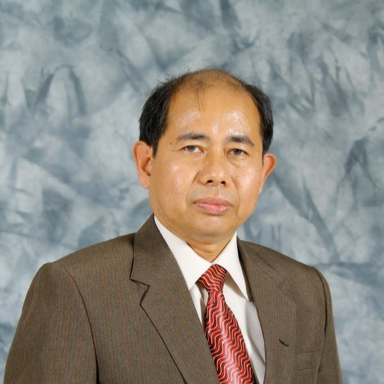
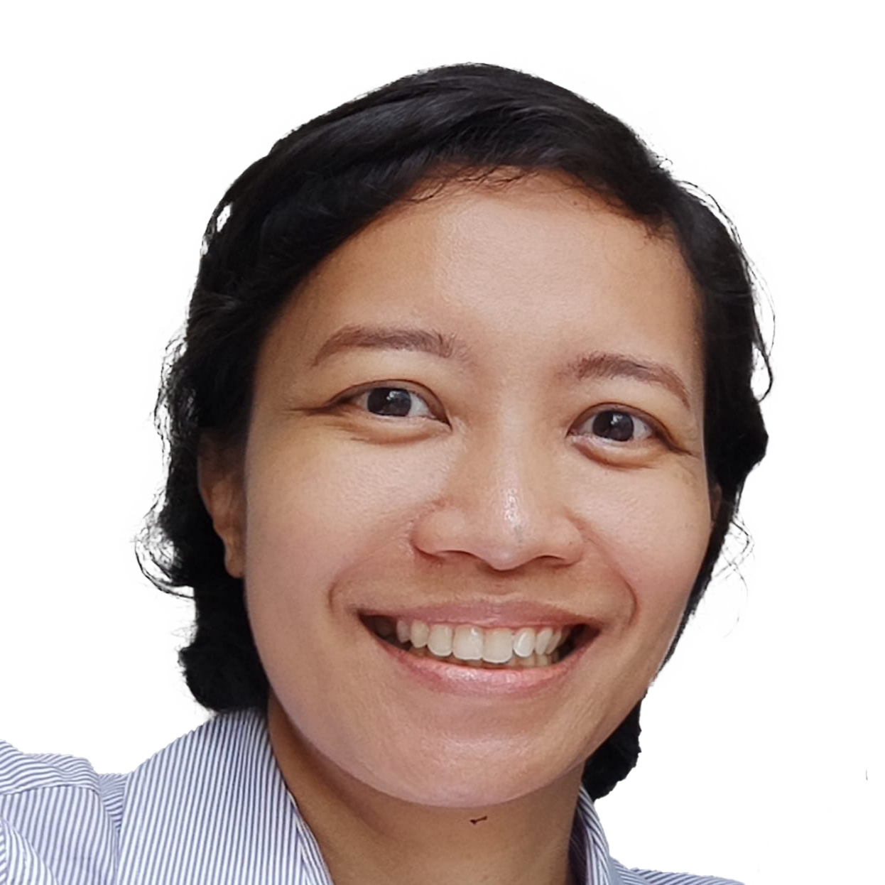
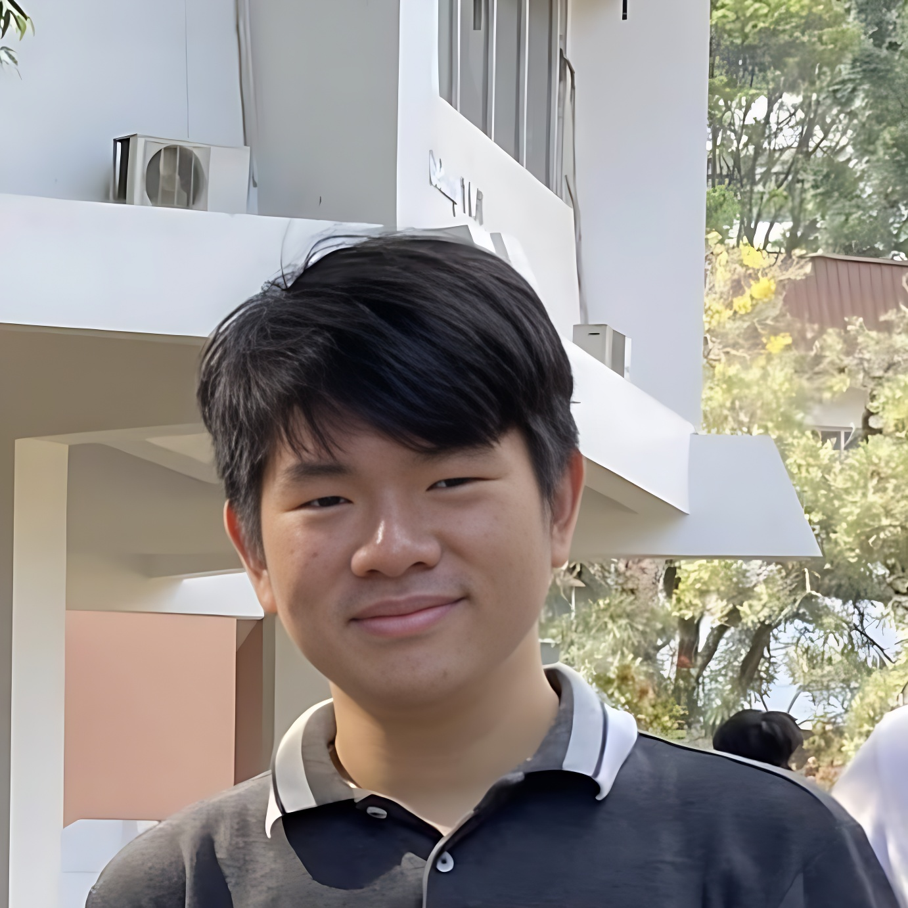
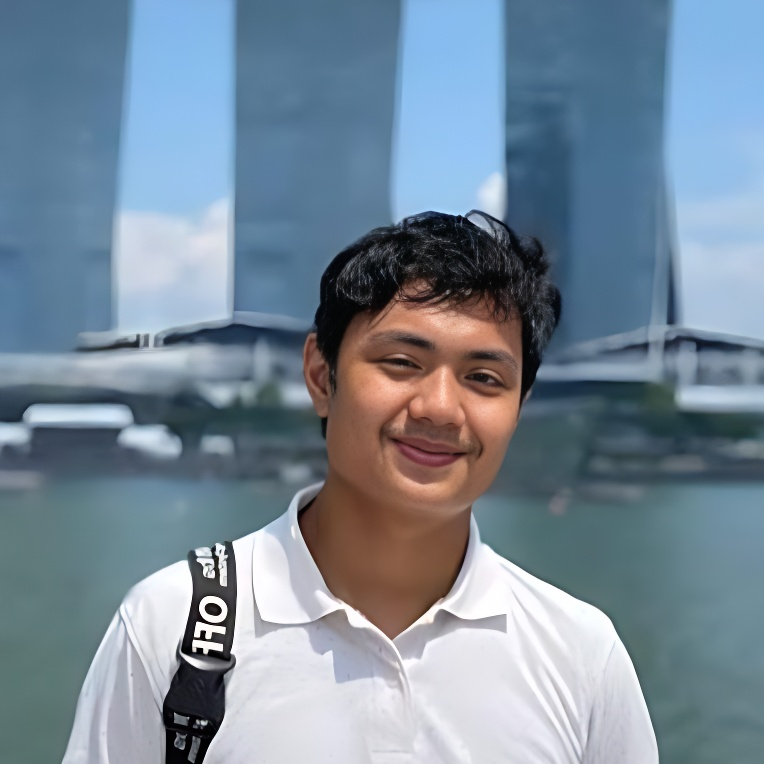
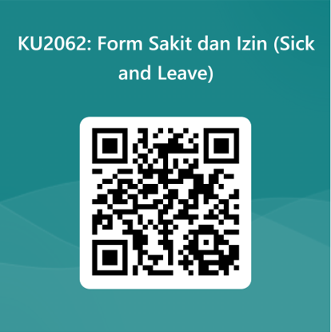

## Laman Informasi

**Informasi Umum:**

- 2 SKS / 6 jam per minggu
- Kelas: Regular (K01 dan K02), IUP (K03), Cirebon (K04), dan Jatinangor (K05)
- Narahubung Mata Kuliah: **Christopher Chandra**
    - [18320033+aep@mahasiswa.itb.ac.id](mailto:18320033+aep@mahasiswa.itb.ac.id) 
    - [Whatsapp](https://wa.me/+6287839954991)
    - Teams

| <h2>Tim Dosen</h2> | &#10240; |
|:---------|:----------------------|
|  | **Dr. Eng. Alamta Singarimbun, D.Min., Ph.D.**  Dosen Pengampu |
|  | **Dr.-Ing. Javensius Sembiring, S.T., M.T.**  Staf Pengajar |
|  | **Debora Situmorang, S.T., S.E.**  Staf Pengajar |
|  | **Kendrik Emkel Ginting, S.T.**  Staf Pengajar |

| <h2>Tim Asisten</h2> | &#10240; |
|:---------|:----------------------|
|  | **Christopher Chandra**  Koordinator Asisten |
|  | **Johann Christian Kandani**  Ketua Kelas K01 |
|  | **Abraham Bartholomeus Caleb Putra Pratomo**  Ketua Kelas K02 |
|  | **Gloria Galore Puandhika Sinaga**  Ketua Kelas K03 |
|  | **Jovi Andreas Bancin**  Ketua Kelas K04 |
|  | **Venny Marcelina**  Ketua Kelas K05 |

**Roster Asisten Kelas dan Mentor**: [Lihat di sini](./pengurus.md)

## Komunikasi dan Tugas

- Teams Code: imsua5p
- Whatsapp Group:
    - [Regular (K01 dan K02)](https://chat.whatsapp.com/EDvnWdB9lm34KfH9srYXb1)
    - [IUP (K03)](https://chat.whatsapp.com/I4GxLEzLSrUFRNTdkw0Fpm)
    - [Multikampus (K04 dan K05)](https://chat.whatsapp.com/BDKZHyzSsPEJksdjba7tUP)

* * *

## Aktivitas Kuliah

Kuliah terdiri atas Komponen Kelas (50%) dan Komponen Tugas (50%). Komponen Kelas dilaksanakan terjadwal di SIX, komponen tugas dilaksanakan secara terdistribusi melalui Kelompook Mentoring.

Pembobotan Nilai semester 1 TA. 2023/2024 (K: Kelas, T: Tugas):

| Komponen | Bobot Penilaian Akhir |
|:---------|:----------------------|
| UTS (K)| 25% |
| UAS (K)| 25% |
| 7MBT (T)| 20% |
| Mentoring (T)| 15% |
| Assignment dan Kehadiran (T)| 15% |

#### Informasi Kelas

| Kelas | Lokasi | Jadwal | Ketua Kelas |
|:------|:-------|:-------|:------------|
| K01 Regular | TVST C - Ganesha | Senin, 13.00 – 15.00 | Johann Christian Kandani |
| K02 Regular | TVST C – Ganesha | Senin, 15.00 – 17.00 | Abraham Bartholomeus Caleb Putra Pratomo |
| K03 IUP | R.9024 – Ganesha | Rabu, 07.00 – 09.00 | Gloria Galore Puandhika Sinaga |
| K04 Cirebon | 9709 | Rabu, 11.00 – 13.00 | Jovi Andreas Bancin |
| K05 Jatinangor | R.U3.07 | Jumat, 07.00 – 09.00 | Venny Marcelina |

#### Informasi Komponen Tugas

Komponen Asisten dilaksanakan dengan Kelompok Mentoring. Tiap Kelompok Mentoring diberikan seorang Mentor yang memimpin keberjalanan 7MBT dan Mentoring. **Komponen Aisten dimulai setelah PRS, pada Minggu 5**
- **Kelompok Mentoring**: _menunggu PRS_
- **7MBT**: 7 Menit Bersama Tuhan, saat teduh rutin harian. [Lihat di sini](./7mbt.md)
- **Mentoring**: diskusi topik terpilih sebanyak 3 kali. [Lihat di sini](./mentoring.md)

* * *

## Kebijakan Kelas

#### Registrasi dan Kelas:

Mahasiswa mendaftar di SIX sesuai dengan Kelas yang terbuka:
- Regular &rarr; K01 atau K02
- IUP &rarr; K03
- Cirebon &rarr; K04
- Jatinangor &rarr; K05

#### Sit-in dan Berpindah Kelas:

Mahasiswa yang belum terdaftar di SIX diizinkan sit-in hingga masa PRS berakhir. Mahasiswa wajib mendaftarkan diri di PRS untuk tetap mengikuti mata kuliah.

Perpindahan kelas harus difinalisasi di SIX.

#### Kehadiran dan keterlambatan:

Kehadiran Peserta dicatat dengan SIX atau absensi manual di kertas hadir.

Kehadiran minimal peserta adalah 50% untuk mengikuti UTS, dan 80% untuk mengikuti UAS.
Keterlambatan lebih dari 20 menit dianggap tidak hadir, kecuali dengan alasan yang jelas.

#### Izin dan sakit:
Hal terkait perizinan diatur sebagai berikut:
- Izin diberikan dengan tanda tangan pihak berkaitan, atau orang tua/wali
- Izin diberikan perihal akademik dan pertugasan
- Izin kolektif diwakilkan satu peserta kuliah saja

Silakan klik link Forms ini untuk mengajukan izin:

[Forms Pengajuan Izin](https://forms.office.com/r/DBD2ENaDMP)

