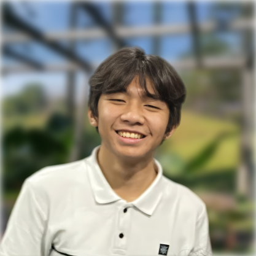
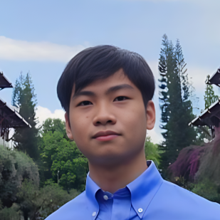

## Laman Informasi

**Informasi Umum:**

- 2 SKS / 6 jam per minggu
- Kelas: Regular (K01 dan K02), IUP (K03), Cirebon (K04), dan Jatinangor (K05)
- Narahubung Mata Kuliah: **Johann Christian Kandani**
    - [13521138+ak@mahasiswa.itb.ac.id](mailto:13521138+ak@mahasiswa.itb.ac.id)
    - [Whatsapp](https://wa.me/+6285158869912)
    - [Teams](https://teams.microsoft.com/l/chat/0/0?users=13521138@mahasiswa.itb.ac.id)

## Tim Dosen

| &#10240; | &#10240; |
|:---------|:----------------------|
|  | **Prof. Dr. Eng. Alamta Singarimbun, D.Min., Ph.D.**  Dosen Pengampu |
|  | **Dr.-Ing. Ir. Javensius Sembiring, S.T., M.T.**  Staf Pengajar |
|  | **Debora Situmorang, S.E., S.T.**  Staf Pengajar |
|  | **Kendrik Emkel Ginting, S.T.**  Staf Pengajar |

##

## Tim Asisten

| &#10240; | &#10240; |
|:---------|:----------------------|
|  | **Johann Christian Kandani**  Koordinator Asisten |
|  | **Abraham Pratomo**  Ketua Kelas K01 dan K02 |
|  | **Billy Setiawan**  Ketua Kelas K03 |
|  | **Jovi Andreas Bancin**  Ketua Kelas K04 |
|  | **Neni Sembiring**  Ketua Kelas K05 |
|  | **Christopher Chandra**  Administrator |

## Komunikasi dan Tugas

- Teams Code: [lbogpg1](https://teams.microsoft.com/l/team/19%3AU6UFm2FGTUDVg8VHsy4pReGVPZmnj8y2_Eq8BXj2SIg1%40thread.tacv2/conversations?groupId=05a1e470-9802-4319-807e-895111af8751&tenantId=db6e1183-4c65-405c-82ce-7cd53fa6e9dc)
- Whatsapp Group:
    - [Regular (K01 dan K02)](https://chat.whatsapp.com/FURCESuInwl5LUShr0Pky9)
    - [IUP (K03)](https://chat.whatsapp.com/I6bd22xIUyR8ZLmZ9QMYb4)
    - [Multikampus (K04 dan K05)](https://chat.whatsapp.com/DAejz3mw98dH63mynSB4KZ)

* * *

## Aktivitas Kuliah

Kuliah WI2012 terdiri atas:
- **Kelas (K)**: kuliah terjadwal, tugas, dan ujian
    - UTS dan UAS
- **Mentoring (M)**: aktivitas dalam Kelompok Mentoring
    - 75days dan Journeys

| Komponen | Bobot Penilaian Akhir |
|:---------|:----------------------|
| UTS + UAS (K)| 50% |
| 75days + Journeys (M)| 50% |

#### Jadwal Kelas

| Kelas | Lokasi | Jadwal | Ketua Kelas |
|:------|:-------|:-------|:------------|
| K01 Regular | TVST C - Ganesha | Senin, 13.00 – 15.00 | Abraham Pratomo |
| K02 Regular | TVST C – Ganesha | Senin, 15.00 – 17.00 | Abraham Pratomo |
| K03 IUP | R.9133 – Ganesha | Kamis, 13.00 – 15.00 | Billy Setiawan |
| K04 Cirebon | - | Rabu, 13.00 – 15.00 | Jovi Andreas Bancin |
| K05 Jatinangor | R.U3.01 | Jumat, 07.00 – 09.00 | Neni Sembiring |

#### Tentang Mentoring

Tiap mahasiswa dikelompokkan dalam Kelompok Mentoring. Seorang Mentor dan Co-mentor akan memandu 75days dan Journeys.
- **75days**: saat teduh rutin harian. [Lihat di sini](https://wi2012.com/75days)
- **Journeys**: diskusi topik terpilih sebanyak 3 kali. [Lihat di sini](https://wi2012.com/journeys)
- untuk pengumpulan **days** dan **Journeys**, [Lihat di sini](https://wi2012.com/kumpul)

* * *

## Kebijakan Kelas

#### Registrasi dan Kelas:

Mahasiswa mendaftar di SIX sesuai dengan Kelas yang terbuka:
- Regular &rarr; K01 atau K02
- IUP &rarr; K03
- Cirebon &rarr; K04
- Jatinangor &rarr; K05

#### Sit-in dan Berpindah Kelas:

Mahasiswa yang belum terdaftar di SIX diizinkan sit-in hingga masa PRS berakhir. Mahasiswa wajib mendaftarkan diri di PRS untuk tetap mengikuti mata kuliah.

Perpindahan kelas harus difinalisasi di SIX.

#### Kehadiran dan keterlambatan:

Kehadiran Peserta dicatat dengan SIX atau absensi manual di kertas hadir.

Kehadiran minimal peserta adalah 50% untuk mengikuti UTS, dan 80% untuk mengikuti UAS.
Keterlambatan lebih dari 20 menit dianggap tidak hadir, kecuali dengan alasan yang jelas.

#### Izin dan sakit:
Hal terkait perizinan diatur sebagai berikut:
- Pengajuan diperbolehkan dengan tanda tangan pihak berkaitan, atau orang tua/wali
- Pengajuan diperbolehkan perihal akademik dan pertugasan
- Pengajuan kolektif diwakilkan satu peserta kuliah saja

Ajukan izin di link berikut: [https://wi2012.com/izin](https://wi2012.com/izin)